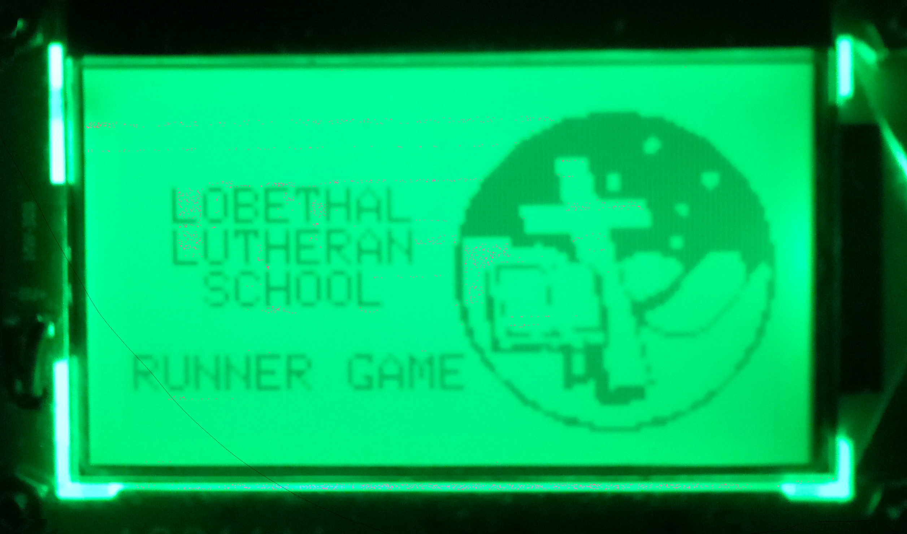
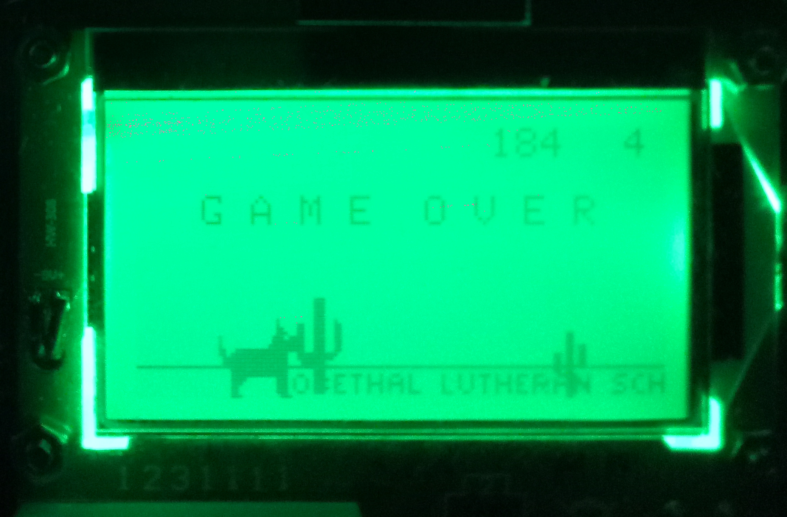
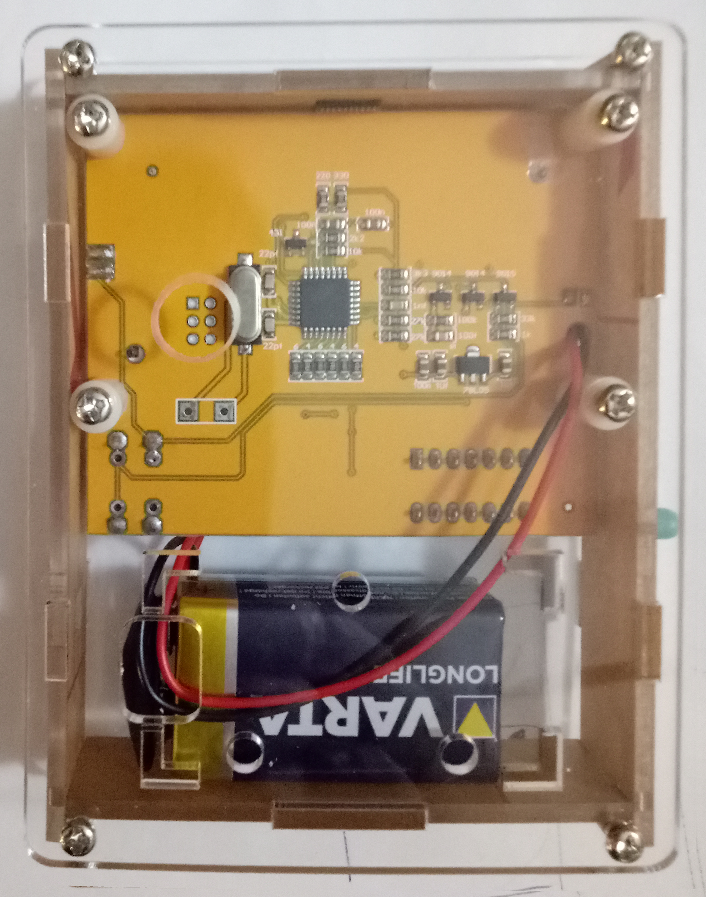
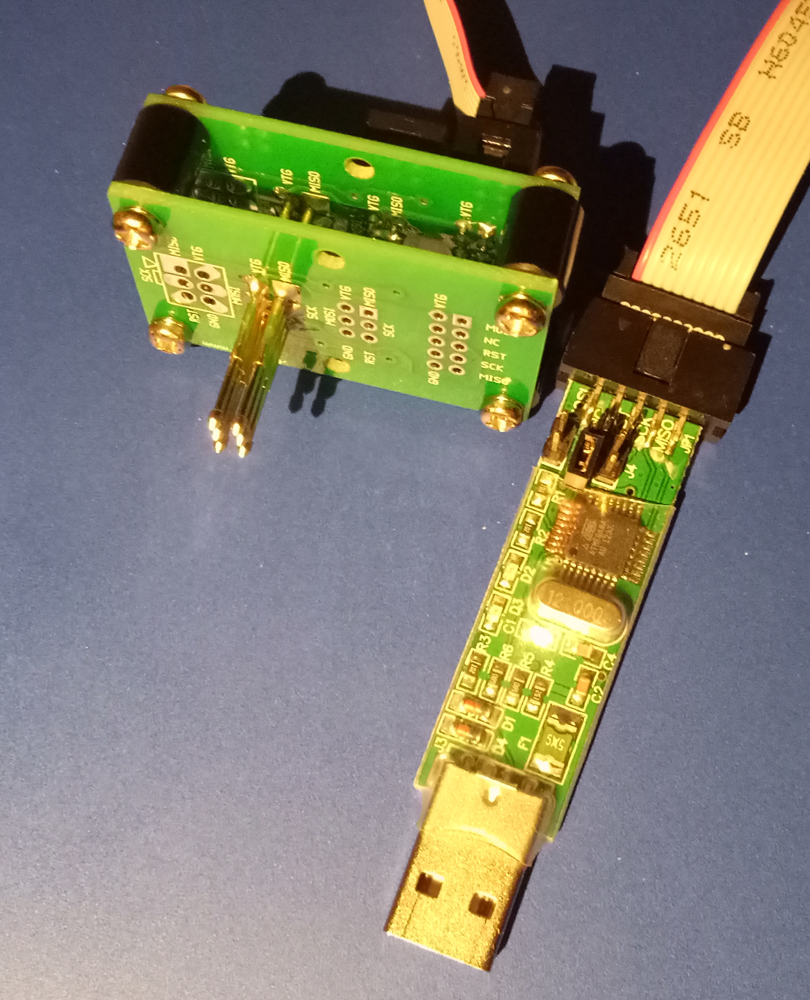

# LLS-STEM-Runner

A repository for game code that can be installed on T3 and T4 component testers.

This project is an ideal vehicle for delivering hands on STEM and coding content to students. 

This work builds on the excellent work of https://dragaosemchama.com/en/2017/01/rex/ found at https://github.com/robsoncouto/rex



Improvements thus far include

 1) changes to the code to allow it to work on T4 v2 component testers
 2) code to convert gimp exported, indexed bitmap C headers to compatible sprites
 3) code to allow rendering of game sprites in the terminal with ASCII 
 4) fixes to the high score read and write code
 5) fixes to score text justification
 6) fixes to GAME OVER text alignment
 7) shell scripts written to simplify backup and restoration of original component tester firmware
 8) simple software debouncing implemented for the button read code 
 9) the full width of 512 bit wide ground sprites now scrolls

TODO
 - Further refactoring of the code
 - Simplified configuration for the various T3, T4 and T4 v2 board versions in the wild
 - Additional game options


The original game written by Robson Couto is based on Chrome's t-rex game written to run on a T3 component tester board.

The code uses a version of the Adafruit ST7565 library modified by Robson Couto.

Descriptions of the various AVR based component tester designs, based on the original by Markus Frejek, can be found at 

https://github.com/Mikrocontroller-net/transistortester/

Makefiles in the various firmware directories give clues to the different pinouts found on the different version of component tester available.

The circuits of the T4v2 and T3 transistor testers differ with respect to the SPI wiring to the ST7565 LCD

		T4v2 vs T3
	reset  PD0  vs PD4
	SCL    PD2  vs PD2
	RS/SW  PD1  vs PD3
	SI/SDA PD3  vs PD1
	CE     PD5  vs PD5 

and these differences have to be reflected in the ST7565 driver code, namely, stlcd.h, for the T4 v2 component tester to work.

## Custom sprites

Custom sprites can be made to replace the T-Rex, ground, or obstacles

A dog sprite:



Tools for this are in sprite_tools

It is recommended that sprites of the same height and width as the existing sprites are used until the code has been refactored further. Currently, the runner_sprites.h file has a dog option enabled, and the T-Rex commented out.

In general, keep sprites to a multiple of 8 pixels in height. Width can be more arbitrary, but bigger sprites will slow things down if enormous.

Ground dimensions: 512 pixels wide, and 8 pixels high

Runner dimensions: 20 pixels wide, and 24 pixels high, and three different pixmaps are used to animate the runner, i.e. legs, or tail

Small obstacles (6 different ones can be used): 8 pixels wide, and 16 pixels high

Large obstacles (6 different ones can be used): 12 pixels wide, and 24 pixels high

To create a sprite, use a graphics program such as the GIMP, and create an image with a black background of the desired dimensions in pixels, i.e. 8 wide and 16 high for a small obstacle.

Use the pencil tool with a white foreground colour to draw the sprite. (Pro tip: the "[" and "]" keys in the GIMP change the brush size).

Once the sprite has been drawn, go to the "->image->mode" menu and turn it into an indexed image with 2 colours.

You can save your work at this point, but most importantly, the image needs to be exported as a "C header file" with a suitable name and default header file ending of ".h".

So, export the image from the GIMP as a C header using the "->file->export as"  menu, and name the exported C header "something.h"

In the sprite_tools directory, the simplest way to turn this into a sprite for use in the runner game is to run

./convert_gimp_header.sh something.h

this will produce a sprite header file called

gimp_sprite.h

which will then be displayed in the terminal as ASCII.

Once the various sprites have been created, they can be merged into the "obstacle_sprites.h" or "runner_prites.h" files, after which the code can be built and flashed onto a component tester.  

See also the README.md in the sprite_tools folder

## Project details

Robson Couto's blog post details how he wrote the original code and ran it on a T3 component tester

English version: http://dragaosemchama.com.br/2017/01/rex/

Portuguese version: http://dragaosemchama.com.br/2017/02/t-rex-ptbt/

## Usage for T4 v2 boards

**backup your flash and eeprom** before attempting to write new firmware.

A 10mm hole is useful 38mm down and 22mm in from the side, over the ICSP programming pads



a suitable pogo pin fixture (i.e. https://github.com/erichVK5/VK5HSE-Pogo-Pin-Adaptor as shown below) can then be used with a programmer such as a USB-ASP (also shown below)



this can be done in the original_firmware directory using the 

extract_firmware.sh

utility

the original, extracted firmware can be written back to the board using the

write_firmware.sh

utility.

If you unsure which version of the component tester you have bought, you should back up the firmware first, then try to install the program code and eeprom code for the various versions found at https://github.com/Mikrocontroller-net/transistortester/ in turn, seeing which version works.

Once you figure out which firmware works on your board, you will know which board revision you have, and can modify the code to reflect any differences in the circuit.

To burn the T4v2 project to the board, connect your programmer and use:

```
make
make program
```

You may have to edit the Makefile for your programmer if it something other than a usbasp on /dev/ttyACM0


